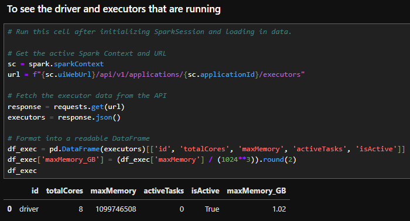
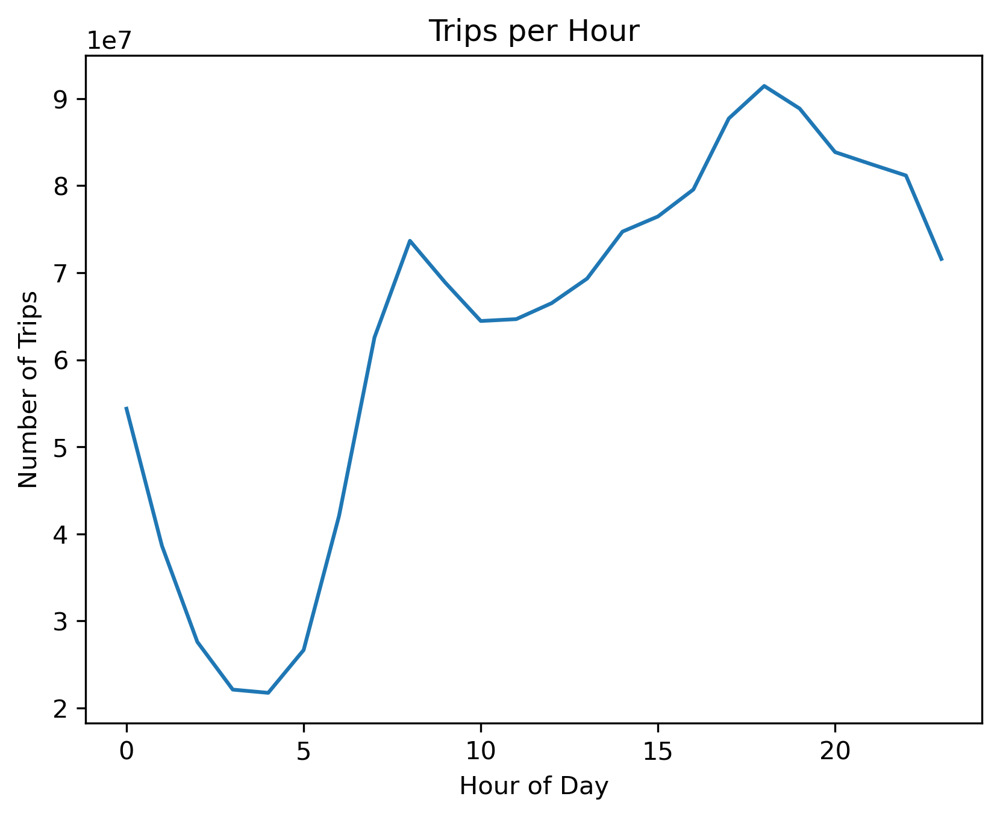
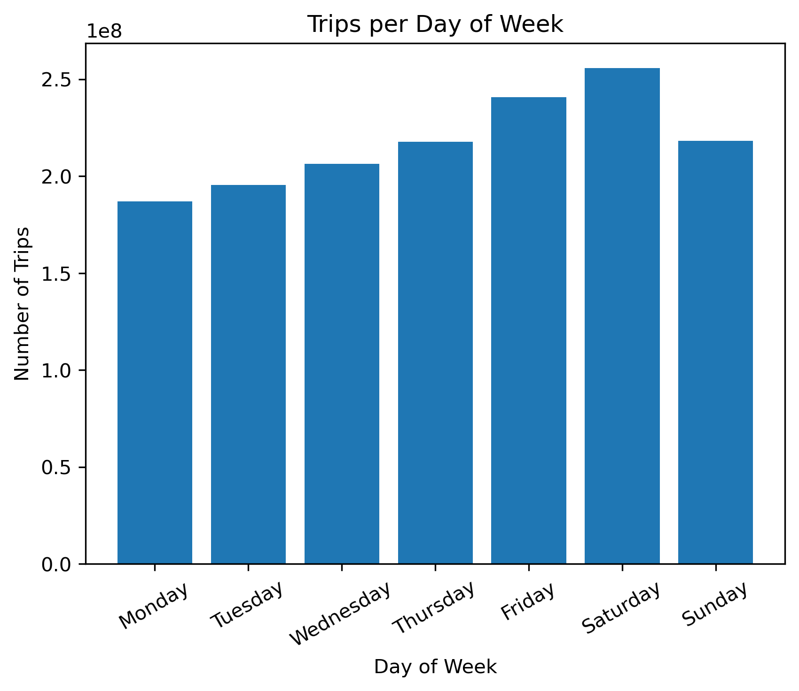
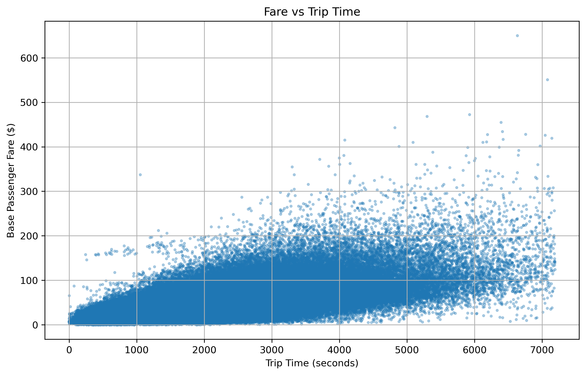
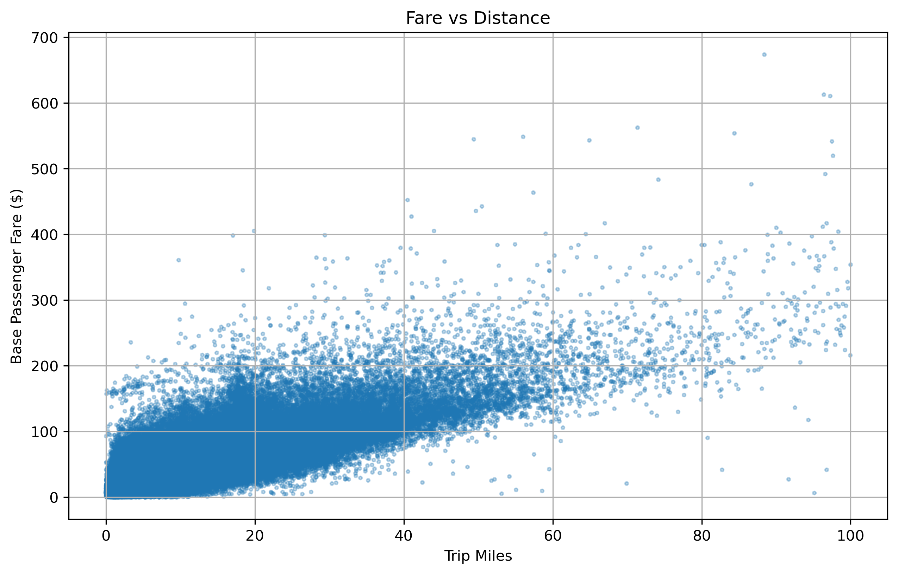
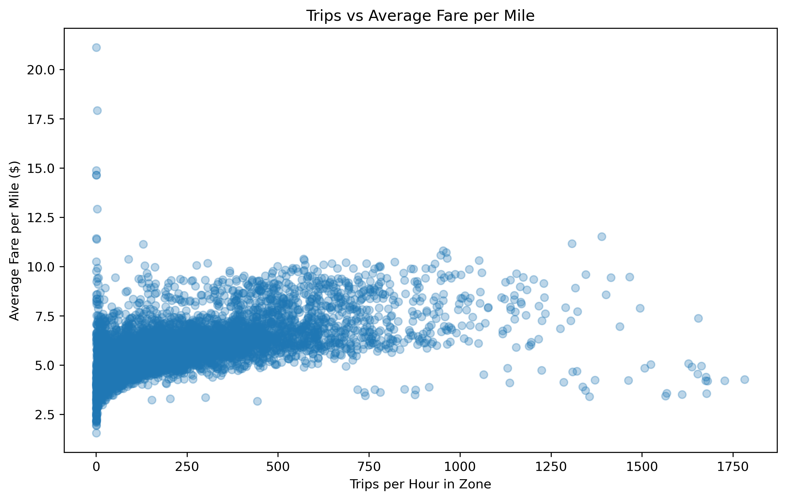
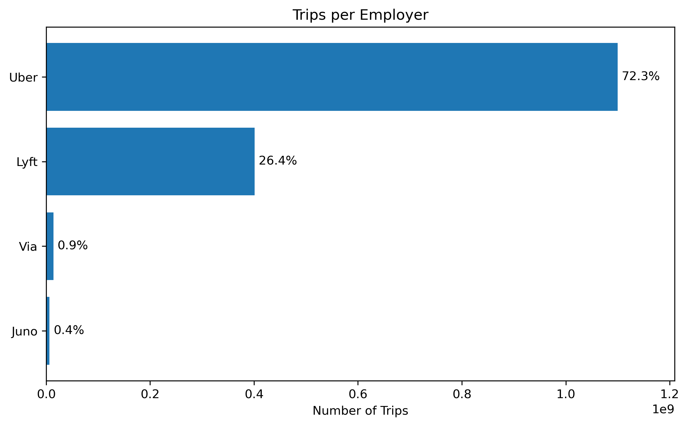

# NYC Taxi Surge Pricing Detection
The topic of dynamic pricing has made its way into headlines with reasonable backlash. Surge pricing is a form of dynamic pricing aimed at increasing the price of a service, such as transportation, during times of high demand. Companies such as Uber and Lyft employ these tactics during peak travel periods, often costing consumers far more than they expected. Here we will use the New York City (NYC) Taxi and Limousine Commission (TLC) trip record data to predict when surge pricing occurs. As surge pricing is not part of the dataset itself, we will create our own measure of surge pricing to utilize for this analysis. If we can predict when surge pricing occurs, consumers may opt use alternative modes of transportation or change their travel times to avoid excessive pricing.

The specific datasets used in this study are from the [NYC Government](https://www.nyc.gov/site/tlc/about/tlc-trip-record-data.page) website, within the time period of February 2019 – February 2026 (the current latest dataset available). Only the High Volume For-Hire Vehicle trips data is being used, a category created specifically for companies that employ drivers and exceed 10,000 trips per day. The datasets contain information about the operating business, dates, times, location, costs, tips, number of passengers, and a few other features. The combined dataset is about 35.6 GB in size (in parquet format) and split into individual files by month with tens of millions of rows in each file. While this may be possible to run on a laptop with libraries such as Dask, it will still take a sizeable amount of time and effort to complete such a task with no reassurance for any failures during runtime. Distributed processing is necessary as it can spread the tasks across multiple computers resulting in faster and efficient processing while also allowing for scalability and fault tolerance.

# 1. Setup and Configuration
Documentation of the working environment and data dictionary.

## 1.1 File Structure
Within the SDSC Environment, the file structure is denoted below:

```
/home/<username>/expanse/lustre/projects/uci157/<username>/nyc_taxi_surge_pricing/
|--- taxi_data/                        # parquet data files - not uploaded to Github
|--- taxi_zone/                        # CSV file containing zone lookup values - not uploaded to Github
|--- visualizations/                   # visualizations generated for analysis
|--- taxi_surge_pricing.ipynb          # notebook with code for analysis
```
> [!TIP]
> The data and visualization folders will be created automatically if you run the Jupyter Notebook.

## 1.2 SDSC Expanse and Spark Session Builder
[SDSC Expanse](https://www.sdsc.edu/systems/expanse/) is a high performance computing (HPC) cluster with an impressive system architecture able to handle high-throughput computing and even provide GPU level support. For our setup we will be initializing the cluster with 8 cores (nodes) and 128 GB of memory (per node). 128 GB of memory might seem unwarranted for a data set that is ~35 GB but it is necessary since we will be doing computations, visualizations, and running ML algorithms for this analysis.

Once logged into SDSC Expanse, we launch a JupyterLab session with the provided cluster information above (8 cores, 128 GB of memory). As this is a shared cluster, there may be a queue before the session becomes available. After it launches, open a Jupyter Notebook and initialize a Spark session as seen in the [Spark Session Variables and Build](https://github.com/Autonomousse/nyc_taxi_surge_pricing/blob/master/taxi_surge_pricing.ipynb#Spark-Session-Variables-and-Build) cell. A breakdown of the calculations and corresponding values is below:

```python
total_executor_cores = 8      # the total number of cores when initializing the session
total_memory = 128 GB         # the total memory when initializing the session
driver_memory_reserve = 2 GB  # the driver coordinates the executors, does not process data

executor_cores = total_executor_cores - 1 (reserves 1 core for the driver, remaining for executors)
executor_memory = (total_memory - driver_memory_reserve) / executor_cores

spark = SparkSession.builder \
.config("spark.driver.memory", f"{driver_memory_reserve}g") \
.config("spark.executor.memory", f"{executor_memory}g") \
.config('spark.executor.instances', executor_cores) \
.getOrCreate()

# Same as above, but with the calculations and values provided for visual reference:
spark = SparkSession.builder \

# 2 reserved for the driver
.config("spark.driver.memory", "2g") \

# (128 - 2) / (8 - 1) = 126 / 7 = 18
.config("spark.executor.memory", "18g") \

# 8 - 1 = 7
.config('spark.executor.instances', 7) \
.getOrCreate()
```
> [!NOTE]
> The driver doesn't need much memory as it processes minimal data from aggregations. For visualizations or ML algorithms, may increase to 4 GB.

> [!IMPORTANT]
> ```from pyspark.sql import SparkSession # import before initializing spark session builder```
> If you are using the provided notebook, this has already been done at the top.

A screenshot of the driver and total memory after loading in the data:


## 1.3 Running the Jupyter Notebook
To run the notebook, the following criteria must be met (or workarounds must be created by the user):

1. Create a .env file in the same directory as the notebook and enter the following:
    - ```user="<username>" # <username> is your username on the server.```
    - This will be read into the notebook automatically to set the path for folder creation.
    - Helps to keep your information safe if you intend to upload your work online.
2. Clone the repo into your user location: ../username/***clone-here***
3. In the Jupter Notebook, under the section labeled [Extract, Transform, and Load data into a Spark Dataframe](https://github.com/Autonomousse/nyc_taxi_surge_pricing/blob/master/taxi_surge_pricing.ipynb#Extract,-Transform,-and-Load-data-into-a-Spark-Dataframe) adjust the file location for the ***base_path*** prior to the username:
    - ```base_path = f'<<<set your folder path up to your username here>>>/{user}/nyc_taxi_surge_pricing/'```
> [!WARNING]
> Please review the dependencies at the top of the notebook prior to running. Some less common dependencies have been added as an install, more may be needed depending on your environment.

# 2. Data Source and Data Dictionary

## 2.1 Data Source
The entire data set can be found here: [NYC Government](https://www.nyc.gov/site/tlc/about/tlc-trip-record-data.page).
- The specific files we are using are the **High Volume For-Hire Vehicle Trip Records** starting from February 2019 to February 2026 (inclusive). These files are available in parquet format, which is the preferred format for analyzing large sets of data.
- The Taxi Zone Maps and Lookup Table in CSV format will also be utilized for this analysis.
- A data dictionary is also provided on the website and here.
> [!TIP]
> If using the provided notebook, all of hte files will be downloaded automatically.
  
## 2.2 Data Dictionary

| Field Name                 | Description                                                                                          |
|----------------------------|------------------------------------------------------------------------------------------------------|
| **hvfhs_license_num**      | The TLC license number of the HVFHS base or business.                                                |
| **dispatching_base_num**   | The TLC Base License Number of the base that dispatched the trip.                                    |
| **originating_base_num**   | Base number of the base that received the original trip request.                                     |
| **request_datetime**       | Date/time when passenger requested to be picked up.                                                  |
| **on_scene_datetime**      | Date/time when driver arrived at the pick-up location (Accessible Vehicles-only).                    |
| **pickup_datetime**        | The date and time of the trip pick-up.                                                               |
| **dropoff_datetime**       | The date and time of the trip drop-off.                                                              |
| **PULocationID**           | TLC Taxi Zone in which the trip began.                                                               |
| **DOLocationID**           | TLC Taxi Zone in which the trip ended.                                                               |
| **trip_miles**             | Total miles for passenger trip.                                                                      |
| **trip_time**              | Total time in seconds for passenger trip.                                                            |
| **base_passenger_fare**    | Base passenger fare before tolls, tips, taxes, and fees.                                             |
| **tolls**                  | Total amount of all tolls paid in trip.                                                              |
| **bcf**                    | Total amount collected in trip for Black Car Fund.                                                   |
| **sales_tax**              | Total amount collected in trip for NYS sales tax.                                                    |
| **congestion_surcharge**   | Total amount collected in trip for NYS congestion surcharge.                                         |
| **airport_fee**            | $2.50 for both drop off and pick up at LaGuardia, Newark, and John F. Kennedy airports.              |
| **tips**                   | Total amount of tips received from passenger.                                                        |
| **driver_pay**             | Total driver pay (not including tolls or tips and net of commission, surcharges, or taxes).          |
| **shared_request_flag**    | Did the passenger agree to a shared/pooled ride, regardless of whether they were matched? (Y/N)      |
| **shared_match_flag**      | Did the passenger share the vehicle with another passenger who booked separately at any point? (Y/N) |
| **access_a_ride_flag**     | Was the trip administered on behalf of the Metropolitan Transportation Authority (MTA)? (Y/N)        |
| **wav_request_flag**       | Did the passenger request a wheelchair-accessible vehicle (WAV)? (Y/N)                               |
| **wav_match_flag**         | Did the trip occur in a wheelchair-accessible vehicle (WAV)? (Y/N)                                   |
| **cbd_congestion_fee**     | Per-trip charge for MTA's Congestion Relief Zone starting Jan. 5, 2025.                              |

## 2.3 Distribution of the Data

These are the columns that we will be using for our analysis:

| Field Name                 | Description                                                                                    |
|----------------------------|------------------------------------------------------------------------------------------------|
| **hvfhs_license_num**      | 4 unique categorical identifiers for Juno (HV0002), Uber(HV0003), Via (HV0004), Lyft (HV0005). |
| **request_datetime**       | Continuous datetime variable for requested pickup time.                                        |
| **pickup_datetime**        | Continuous datetime for pick-up.                                                               |
| **dropoff_datetime**       | Continuous datetime for drop-up.                                                               |
| **PULocationID**           | Categorical zone identifier where the trip began. 265 values.                                  |
| **DOLocationID**           | Categorical zone identifier where the trip ended. 265 values.                                  |
| **trip_miles**             | Continuous variable for total miles.                                                           |
| **trip_time**              | Continuous variable for total time of the trip in seconds                                      |
| **base_passenger_fare**    | Continuous variable for base fare.                                                             |
| **tolls**                  | Continuous variable for all tolls paid in trip.                                                |
| **bcf**                    | Continuous variable for total amount collected for Black Car Fund.                             |
| **sales_tax**              | Continuous variable for total amount collected for NYS sales tax.                              |
| **congestion_surcharge**   | Continuous variable for total amount collected for NYS congestion surcharge.                   |
| **airport_fee**            | $2.50 for both drop off and pick up at LaGuardia, Newark, and John F. Kennedy airports.        |
| **tips**                   | Continuous variable for total amount of tips received from passenger.                          |
| **driver_pay**             | Continuous variable for total driver pay.                                                      |
| **shared_request_flag**    | Binary variable for shared/pooled ride.                                                        |
| **shared_match_flag**      | Binary variable for if the passenger shared a ride.                                            |
| **access_a_ride_flag**     | Binary variable for if trip was administered on behald of MTA.                                 |
| **wav_request_flag**       | Binary variable for if passenger requested a wheelchair-accessible vehicle.                    |
| **wav_match_flag**         | Binary variable for if the trip occurred in a wheelchair-accessible vehicle.                   |
| **surge_price**            | Binary target variable that will be defined and calculated in the next steps.                  |

Here we can see some quick summary stats of the data:

| Summary    | trip_miles  | trip_time  | base_passenger_fare | tolls      | bcf        | sales_tax  | congestion_surcharge | airport_fee | tips       | driver_pay |
|------------|-------------|------------|---------------------|------------|------------|------------|----------------------|-------------|------------|------------|
| **count**  | 1521319081  | 1521319081 | 1521319081          | 1521319081 | 1521319081 | 1521319081 | 1520806040           | 1106884027  | 1521319081 | 1521319081 |
| **mean**   | 4.9256      | 1156.1248  | 23.0378             | 1.0285     | 0.6308     | 1.9330     | 1.0175               | 0.1983      | 0.9709     | 18.2325    |
| **stddev** | 5.7233      | 830.2167   | 20.8419             | 3.6747     | 0.6331     | 1.7166     | 1.3173               | 0.6790      | 3.0405     | 16.1434    |
| **min**    | 0.0         | 0          | -1969.5900          | 0.0        | 0.0        | -3.0000    | 0.0                  | 0.0         | 0.0        | -6867.2800 |
| **max**    | 5380.7800   | 240764     | 8157.7400           | 1720.0     | 213.0200   | 724.0800   | 13.7500              | 10.0        | 1000.0     | 4894.6200  |

# 3. Exploratory Data Analysis and Visualizations

## 3.1 Surge Conditions - When are surge conditions more likely?


Taking a look at trips per hour shows us when surge pricing is likely to occur. When the number of trips per hour is increasing, that is a likely scenario when the prices may surge. From the chart it looks like prices will typically be higher around the hours of 5 am - 7 am and again from 10 am - 6 pm.



This chart maps the number of trips per day, we can see a trend of rising trips as the week goes on. Surge pricing is likely to occur on the days with the highest number of trips. Friday and Saturday when most people are out for the weekend are ideal for increased fares.

## 3.2 Price Vs Distance - Are there unusual prices?


We can see here that the base passenger fare seems to vary quite a lot regardless of the total time of the trip. This indicates that there may be surge pricing because a short trip can cost the same amount as a much longer trip.



This is similar to the last chart but the fare versus the distance traveled in miles. It seems like there is a similar correlation here where the price can vary regardless of distance.

## 3.3 Demand Vs Price - Is there a relationship here?


This is the number of trips per hour in a zone versus the average price per hour. What this shows us is that there seems to be a high concentration on the left side where there are the lowest trips per hour but the average price varies quite a bit. This suggests that there may be surge pricing involved because the price is still within the 4-6 dollar range even at 500 trips per hour.

## 3.4 Unique Employer Breakdown - Is there an even distribution or does one company have a majority?


This is just to see if there is an even distribution of drivers for each employer. It seems like Uber has a significant market share with Lyft coming in second. Juno and Via are almost nonexistent. This kind of control would allow for surge pricing as there are less options from competitors.

# 4. Preprocessing Plan

It doesn't seem like there is much missing data for the numerical variables. The largest dropoff is for the airport fee which is a flat amount. We can check to see if most of these missing values are part of Juno and Via and drop them as there isn't much market share here to begin with. If not, we can either impute the values to have minimal effect on the relationship of the data. For the categorical variables there are missing values but these features may not have a strong effect on surge pricing as they are just binary values for different flags related to passenger preferences. These columns will most likely be dropped.

We will be using feature engineering to create a surge_pricing column to detect the effect of surge pricing. For the rest of the columns we will apply scaling and encoding based on their values using techniques like OneHotEncoding.

For preproccessing we will use Spark operations such as:
- dropna()
- fillna()
- withColumn()
- filter()
- OneHotEncoder()
- groupBy()
- agg()
- and more if needed depending on use case.